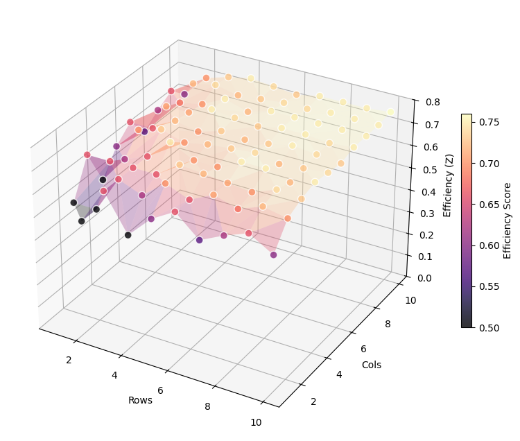

# 🌱 Sugarcanes Optimization

## 📖 The Problem

The field is divided into equal rectangular blocks.

Each block can be in **exactly one** of the following states:

| State | Symbol | Description |
|-------|:------:|-------------|
| **Water** | 💧 | The block contains a water source. |
| **Humid** | 🌱 | The block is adjacent (up/down/left/right) to a water block. |
| **Dry** | 🟫 | The block is not adjacent to any water source. |

> ⚠️ Diagonal adjacency does **not** count.

---

## 🎯 Optimization Goal

Given the function:

```c
void sugarcanes(const int length, const int width);
```

The algorithm computes the configuration that:

1. Maximizes the number of **humid** blocks  
2. Minimizes the number of **water** blocks (if tied)

---

## 🧩 Example

### Initial 3×3 Grid

```
🟫 🟫 🟫
🟫 🟫 🟫
🟫 🟫 🟫
```

### After Placing One Water Source (Center)

```
🟫 🌱 🟫
🌱 💧 🌱
🟫 🌱 🟫
```

Only **orthogonal neighbors** become humid.

---

## 🧠 Algorithm Strategy

### 1️⃣ Backtracking

Each cell has two possible decisions:

- Place water
- Do not place water

This generates a decision tree of depth:

```
rows × cols
```

---

### 2️⃣ Incremental Updates (O(1) per step)

Instead of recomputing the entire grid at every recursion:

- Only the selected cell and its 4 neighbors are updated
- The humid count is updated incrementally
- An explicit **UNDO** restores exactly 5 cells

This keeps each recursive step in:

```
O(1)
```

---

### 3️⃣ Branch & Bound Pruning

To reduce the exponential search space, the algorithm computes an upper bound:

```
max_possible_humid
```

If:

```
max_possible_humid < bestHumid
```

the branch is pruned immediately.

This significantly improves practical performance.

---

## 📈 Data Analysis & Efficiency 
### The Theoretical Upper Bound: 80% 
A key mathematical insight of this problem is the maximum efficiency limit. Each water source occupies **1 block** and can hydrate at most **4 adjacent blocks**. In an ideal, infinite grid (ignoring boundaries), every group of 5 blocks would consist of 1 water source and 4 humid blocks. Therefore, the **theoretical upper bound** for the fraction of cultivable blocks is: $$\frac{4}{5} = 0.8 $$
 ### 3D Efficiency Visualization 
 To visualize how the algorithm performs across different grid sizes, we plotted the results where: 
 * **X-axis**: Number of Rows 
  * **Y-axis**: Number of Columns 
  * **Z-axis**: Efficiency ($\frac{\text{humidBlocks}}{\text{row} \times \text{col}}$) 
    
  
  **The Data Narrative:** The plot uses a color gradient to tell a story of optimization: 
  * **The Edge Effect (Small Grids):** In smaller grids, "cold" colors represent lower efficiency. This is because boundaries restrict water sources from reaching their full 4-block potential. For example, a $1 \times 1$ grid has $0\%$ efficiency, while a $2 \times 2$ grid reaches $50\%$ ($Z = 0.5$). 
  *  **Asymptotic Growth (Large Grids):** As dimensions increase, "warmer" colors appear. The relative impact of the edges diminishes, and the surface trends toward the $0.8$ asymptote. On a $10 \times 10$ grid, the algorithm achieves an efficiency of $76\%$.
   

---

## 🏗 Project Structure

```
.
├── sugarcanes.h
├── sugarcanes.c
└── README.md
```

### sugarcanes.h

- Grid state definitions (`dry`, `water`, `humid`)
- `Matrix` structure
- Public function declaration

### sugarcanes.c

- Grid utilities
- Incremental recomputation logic
- Recursive solver with pruning
- Output formatting

---

## 📊 Complexity

Worst-case complexity:

```
O(2^(rows × cols))
```

However, pruning and bounding reduce runtime significantly for medium-sized grids.

---

## 🧠 Key Design Choices

- ✔ Incremental update instead of full recomputation  
- ✔ Explicit UNDO for safe backtracking  
- ✔ Upper-bound pruning heuristic  
- ✔ Memory-efficient 1D array representation  

---

This project demonstrates how careful algorithm design dramatically improves performance compared to naive brute-force exploration.